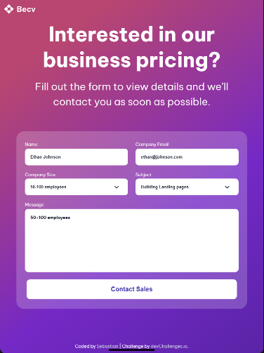

<!-- Please update value in the {}  -->

<h1 align="center">contact page | devChallenges</h1>

   Solution for a challenge <a href="https://devchallenges.io/challenge/contact-page" target="_blank">Contact Page</a> from <a href="http://devchallenges.io" target="_blank">devChallenges.io</a>.

  <h3>
    <a href="https://contact-page-beryl.vercel.app/">
      Demo
    </a>
     | 
    <a href="https://github.com/Sebascode20/contact-page">
      Solution
    </a>
     | 
    <a href="https://devchallenges.io/challenge/contact-page">
      Challenge
    </a>
  </h3>

<!-- TABLE OF CONTENTS -->

## Table of Contents

- [Overview](#overview)
- [Built with](#built-with)
- [Contact](#contact)

<!-- OVERVIEW -->

## Overview

This project is a professional contact page designed to collect business inquiries and pricing requests. It features a responsive contact form that allows potential clients to submit their company information and specific requirements. The page is built with a modern, clean design that emphasizes user experience and form accessibility.
consists of

This project includes:

- **Contact Form**: A fully functional form with input fields for user name, email address, company name, and detailed message
- **Responsive Design**: Mobile-first approach that adapts seamlessly to different screen sizes
- **Professional Styling**: Clean, modern layout with custom fonts and SVG graphics
- **Form Validation**: Built-in HTML5 form validation for required fields
- **Accessibility**: Proper semantic HTML structure for better accessibility

### Built with

This project was developed using the following technologies:

- **HTML5**: Semantic markup for form structure and accessibility
- **CSS3**: Advanced styling with flexbox, responsive design, and modern CSS features
- **Be Vietnam Pro Font**: Custom font from Google Fonts for professional typography
- **SVG**: Vector graphics for logo and background elements
- **Responsive Design**: Mobile-first approach using CSS media queries

## Author

- GitHub [@Sebascode20](https://{github.com/Sebascode20})
